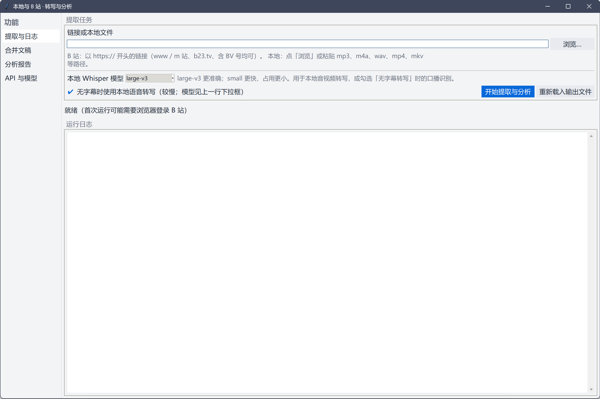
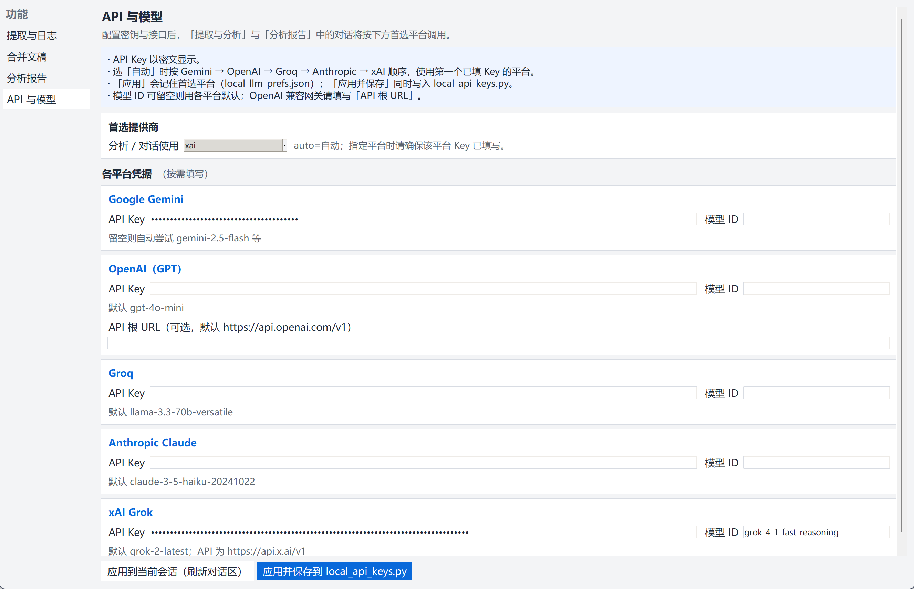
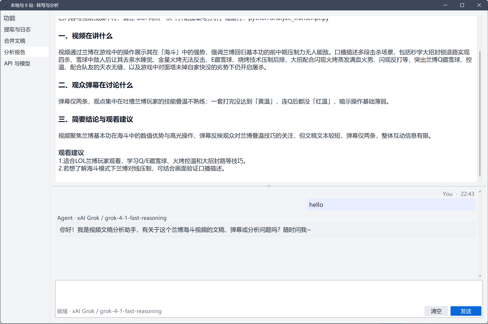

<div align="center">

# VLV · Video Listen View

**V**ideo **L**isten **V**iew：**本地文件与 B 站链接** → 字幕 / 弹幕 / 可选 **Whisper** 转写 → 合并文稿 → **多模型 LLM** 分析与对话 →（可选）**抽帧 + 本地 VLM** 深度画面理解。

基于 [bilibili-transcript-oneclick](https://github.com/Jcxu97/bilibili-transcript-oneclick) 演进：**源码集中在 `src/bilibili_vision/`**，根目录保留便携启动脚本与数据目录；适合 Windows 便携包（嵌入式 Python + Playwright）。GitHub 仓库名为 **`vlv`**（旧名 `listenview` / `bilibili-transcript-oneclick-vision` 访问时会重定向）。

[](https://github.com/Jcxu97/vlv/actions/workflows/ci.yml)
[](LICENSE)
[](https://www.python.org/)
[]()

[**预览**](#预览) · [**功能**](#功能) · [**大模型建议**](#大模型建议) · [**快速开始**](#快速开始) · [**项目结构**](#项目结构) · [**命令行**](#命令行) · [**Vision**](#vision) · [**相关项目**](#相关项目)

</div>

---

## 预览

以下为界面全宽截图（依次：提取与分析 → API 与模型 → 分析与对话），便于看清细节。

### 提取与分析



### API 与模型



### 分析与对话



---

## 功能

| 能力 | 说明 |
|------|------|
| **图形工作台** | **VLV**：提取 → 总结 → 多轮对话；可选「深度内容分析」 |
| **B 站** | Playwright 登录、会话持久化、`cookies.txt` 供 yt-dlp |
| **无字幕** | yt-dlp 拉音频 + **faster-whisper**（可选 GPU） |
| **多模型** | Gemini / OpenAI / Groq / Anthropic / xAI 等；分析侧纯 `urllib`，无重型 LLM SDK |
| **本地 OpenAI 兼容** | 对接本机 **Gemma 4 4-bit** 等服务（HTTP `/v1`） |
| **Vision** | 抽帧、OCR（见 `requirements-vision.txt`）、`vision_deep_pipeline` + 本地 VLM |

---

<a id="大模型建议"></a>

## 大模型建议

- **更推荐直接用云端 API**：在 GUI **「API 与模型」** 里填 **Gemini / OpenAI / Groq / Anthropic / xAI** 等平台的 Key 即可，**上手最快、维护成本最低**，不必在本机折腾推理环境与显存。
- **本地部署大模型（完全自选）**：仓库里的 **Gemma / Qwen、OpenAI 兼容服务**（如 `SERVE_GEMMA4_4BIT.bat`）只是**可选路径**，需要你**自行准备**显卡、CUDA、权重下载与服务稳定性；适合有硬件与排障经验的用户，**普通用户不必强求**。
- **画面理解（Vision）** 同理：若你的 API 提供商支持多模态，可优先走云端；本地 VLM 同样依赖本机资源与自建服务，按需选用即可。

---

## 快速开始

### 环境

- **Windows 10 / 11 x64**（脚本与说明以此为主）
- 首次准备需能访问 **python.org、pip、Playwright CDN**（按需 **Hugging Face**）

### 步骤

1. **克隆仓库**
   ```bash
   git clone https://github.com/Jcxu97/vlv.git
   cd vlv
   ```
2. **一键准备便携目录**（仓库根目录 PowerShell）：
   ```powershell
   Set-ExecutionPolicy -Scope CurrentUser RemoteSigned -Force
   .\准备便携环境.ps1
   ```
   脚本会：下载 **嵌入式 Python**、安装依赖、（可选）预下 Whisper 权重、安装 Chromium 到 `pw-browsers/`，并在 `python_embed/*._pth` 中写入 **`..\src`**，使 `python -m bilibili_vision.*` 可直接运行。
3. **GPU 转写**（可选）：
   ```powershell
   .\python_embed\python.exe -m pip install -r requirements-gpu.txt
   ```
4. **启动 GUI**：双击 **`START.bat`** 或 **`启动.bat`**（等价于 `python_embed\python.exe run_gui.py`）。
5. **分析与对话**：打开 **「API 与模型」**，填入至少一个云端 Key（见上节 **[大模型建议](#大模型建议)**）；即可总结、深度分析与多轮对话，无需先搭本地大模型。

**离线 / 内网**（仅本地文件转写）：拷贝完整便携目录（含 `python_embed/`、`whisper-models/<模型>/`、`ffmpeg/` 下 `ffmpeg.exe` / `ffprobe.exe`），使用 **`START_OFFLINE.bat`**。B 站链接仍需外网。

**跳过 Whisper 预下载**：`.\准备便携环境.ps1 -SkipWhisperModel`  
**仅下载 Whisper 模型**：`.\DOWNLOAD_WHISPER.bat`  
**tkinter**：`.\INSTALL_TKINTER.bat`  
**Chromium 失败**：`install_chromium.bat` 或多试几次，或参考 [Playwright 文档](https://playwright.dev/docs/browsers)。

---

## 项目结构

成熟 Python 项目常见的 **`src/` 布局**：应用包名 **`bilibili_vision`**，运行时数据仍在仓库根。

```text
.
├── run_gui.py                 # 根入口：把 src 加入 path 后启动 GUI
├── START.bat / 启动.bat       # 便携启动
├── src/
│   └── bilibili_vision/       # 全部应用代码（pipeline、GUI、LLM、Vision…）
├── out/                       # 会话输出（默认 .gitignore）
├── docs/screenshots/          # README 配图
├── requirements*.txt
└── .github/workflows/         # CI（语法检查 src/bilibili_vision）
```

**路径约定**：`bilibili_vision.paths.PROJECT_ROOT` 指向仓库根，用于 `out/`、`models/`、`cookies.txt` 等；与包内源码目录分离。

**Cursor 协作（可选）**：仓库内附带项目级 Skill **`.cursor/skills/claude-code-multi-agent-harness/SKILL.md`**，约定复杂任务下的主动编排、少打扰用户、以及检索时优先 **DOI 论文 / 高星 GitHub** 等可验证来源（见该文件说明；**非**运行时代码）。

---

## 命令行

使用 **`python_embed\python.exe`**（或已配置好 `PYTHONPATH=src` 的系统 Python）：

```bat
python_embed\python.exe -m bilibili_vision.bilibili_pipeline extract "https://www.bilibili.com/video/BVxxxx"
python_embed\python.exe -m bilibili_vision.bilibili_pipeline extract --asr-if-no-subs --whisper-model small "https://..."
```

开发者也可：

```bat
set PYTHONPATH=%CD%\src
python -m bilibili_vision.bilibili_pipeline --help
```

---

<a id="vision"></a>

## Vision / 本地 VLM

**说明**：与「大模型建议」一致——**有云端多模态 API 时优先用云端更省事**；本节描述的是**可选**的本地 OpenAI 兼容服务联调。

GUI 与管线通过 **`local_vlm_openai_client`** 调用 OpenAI 兼容接口。默认与 **`SERVE_GEMMA4_4BIT.bat`**（`http://127.0.0.1:18090/v1`）联调。

1. 配置 **Gemma 4 4-bit** 环境并启动服务（脚本会维护 `venv_gemma4`，**不入库**）。
2. 单图 / 单帧测试：`TEST_GEMMA4_VISION.bat` 或：
   ```bat
   set PYTHONPATH=%~dp0src
   venv_gemma4\Scripts\python.exe -m bilibili_vision.local_vlm_openai_client --image 某图.jpg --prompt "描述画面"
   ```

OCR、PaddleOCR 等见 **`requirements-vision.txt`**。可选 Qwen3.5 服务：`SERVE_QWEN35.bat`、`TEST_QWEN35_VISION.bat`。

---

## API / 密钥

**推荐**：直接使用各平台 **官方 API Key**（见 **[大模型建议](#大模型建议)**）。在 GUI **「API 与模型」** 中填写即可。

也可复制 `local_api_keys.example.py` → **`local_api_keys.py`**（勿提交），或配合环境变量；逻辑见 `llm_analyze.py`。

---

## 本仓库不包含

体积大或机器相关的内容在 **`.gitignore`** 中，需本地生成或自备：

| 路径 | 说明 |
|------|------|
| `python_embed/` | 嵌入式 Python + pip 依赖（`准备便携环境.ps1`） |
| `pw-browsers/` | Playwright Chromium |
| `whisper-models/` | Whisper 权重（可脚本预下载） |
| `ffmpeg/*.exe` | 可选本地 FFmpeg |
| `models/` | 本地大模型权重 |
| `venv_gemma4/`、`venv/` | 虚拟环境 |

---

## 推送到 GitHub

已安装 [Git](https://git-scm.com/) 与 [GitHub CLI](https://cli.github.com/) 时：

```powershell
gh auth login -h github.com -p https -w
powershell -ExecutionPolicy Bypass -File ".\一键推送GitHub.ps1"
```

或网页创建空仓库后：`git remote add origin …`，`git push -u origin main`。勿提交密钥与 `cookies.txt` 等。

---

## 相关项目

与「B 站 / 字幕 / Whisper / 本地转写」生态相关的优质开源项目（侧重不同，可对照选用）：

| 项目 | Stars 量级（约） | 侧重点 |
|------|------------------|--------|
| [yt-dlp/yt-dlp](https://github.com/yt-dlp/yt-dlp) | 极高 | 通用音视频下载；本仓库通过 yt-dlp 拉流 |
| [SYSTRAN/faster-whisper](https://github.com/SYSTRAN/faster-whisper) | 高 | 高效 Whisper 推理；本仓库 ASR 基于此 |
| [lanbinleo/bili2text](https://github.com/lanbinleo/bili2text) | 高 | B 站 → 文字，多引擎与多端 |
| [LuShan123888/Bilibili-Captions](https://github.com/LuShan123888/Bilibili-Captions) | 中 | 多平台字幕 + MCP |
| [pluja/whishper](https://github.com/pluja/whishper) | 中 | 本地转写 Web UI |

**本仓库差异**：弹幕与字幕合并、Playwright 登录与 cookie、Windows 便携组装，以及 **合并文稿上的 LLM 报告 + 同页对话**，并扩展 **Vision / 本地 VLM** 管线。

---

## 安全

勿公开 `local_api_keys.py`、`local_llm_prefs.json`、`cookies.txt`、`browser_state.json`。详见 [`SECURITY.md`](SECURITY.md)。

---

## 许可证

[MIT License](LICENSE)

---

## English

**VLV** (**V**ideo **L**isten **V**iew — local files & Bilibili) packages the app under **`src/bilibili_vision`**, with **`run_gui.py`** at the repo root. Large binaries (`python_embed`, browsers, Whisper weights, optional FFmpeg) stay **out of Git**; run **`准备便携环境.ps1`** to bootstrap. Use **`START.bat`** for the GUI. For air-gapped local transcription, copy a full portable tree and run **`START_OFFLINE.bat`**.

**LLM usage:** **Cloud APIs (Gemini, OpenAI, Groq, etc.) are recommended** for the easiest setup—just add keys in **API & models**. **Local LLM / VLM stacks** (Gemma, Qwen, OpenAI-compatible servers) are **optional** and require you to manage GPUs, weights, and services yourself.
